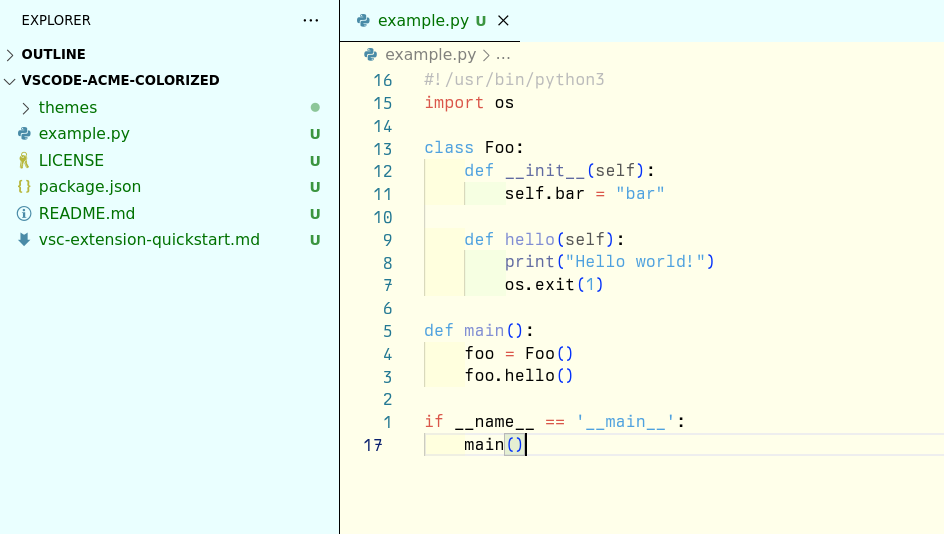

# Colorized VSCode Acme

This is a visual studio code color scheme based on [foolusion/acme-theme](https://github.com/foolusion/acme-theme) and [Bells Lab's Acme](http://acme.cat-v.org/).

This version adds syntax highlighting colors based on snappy-light from [rainglow/vscode](https://github.com/rainglow/vscode).

